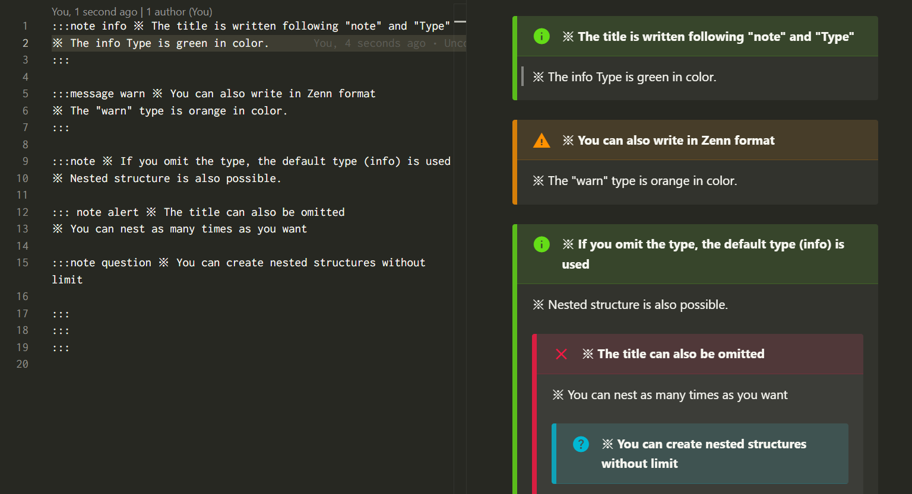

# Markdown Info


**VSCode Markdown Info** is a Visual Studio Code extension that allows you to easily create “adomonition box” within your Markdown documents.

Using this extension, you can easily add [Qiita](https://qiita.com/) or [Zenn](https://zenn.dev/) style adomonition box to visually highlight important information.



<!-- omit in toc -->
## TOC
- [Setup](#setup)
- [Quick usage](#quick-usage)
- [Usage](#usage)
- [Features](#features)
- [Configuration](#configuration)
- [Credits](#credits)
- [Used Plugins](#used-plugins)
- [Acknowledgments](#acknowledgments)

## Setup
Enter “**Markdown Info**” in the VScode marketplace.

<p align="center">

</p>

## Quick usage
| Format | Markdown | 
| ------------- | ---------------------------- | 
| Qiita Format | `:::note Type Title` |
| Zenn Format | `::message Type Title` | 

Qiita Format:


Zenn Format:


## Usage
This is an extension that allows you to create “adomonition boxes” in Qiita or Zenn format on VSCode.

The adomonition box is created in the following format:

```markdown
:::note Type Title
content
:::
```

or

```markdown
:::message type Title
Content
:::
```

There are four types of Info boxes

1. info (default): general information
2. warn: warning
3. alert: strong warning
4. question: question or doubt

## Features
- The default type is “info”; note that this differs from Zenn's original specification.
- The title is written immediately after the type. This is different from the original specification of Qiita.
- The adomonition box also supports nested structure, so complex information can be displayed in an organized manner.

## Configuration
### Default Title
You can set a default value that will be reflected if no title is specified.
The default value is “**Please write the title here**”.


### Preview Styles
You can select the CSS stylesheet that will be reflected in the Markdown preview screen. 

The available options are as follows:


default: Use the default style sheet.


qiita: Apply Qiita-style stylesheet.


zenn: Apply Zenn-style stylesheet.


## Credits
The icon displayed in the VScode extension is a combination of these two images:

| Image | License | Author/Site |
|-------|---------|-------------|
| [Free Markdown Icon](https://iconscout.com/free-icon/markdown-1)  | [MIT License](https://opensource.org/license/MIT) | [Benjamin J sperry](https://iconscout.com/contributors/benjamin-j-sperry) / [IconScout](https://iconscout.com/) |
| [info icon](https://fonts.google.com/icons?selected=Material+Symbols+Outlined:info:FILL@0;wght@400;GRAD@0;opsz@24&icon.query=info&icon.size=24&icon.color=%232a6200) | [Apache License, Version 2.0](https://www.apache.org/licenses/LICENSE-2.0) | [Material Symbols & Icons - Google Fonts](https://fonts.google.com/icons) |


## Used Plugins
- [yusu79/markdown-it-info](https://github.com/yusu79/markdown-it-info)

## Acknowledgments
In developing this project, we referenced the following open source software. We would like to express our gratitude:

- [qjebbs/vscode-markdown-extended](https://github.com/qjebbs/vscode-markdown-extended)
