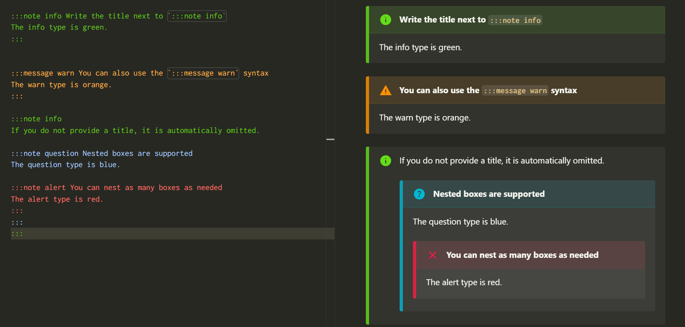
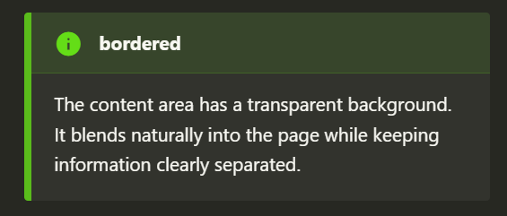
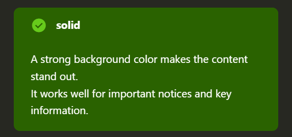
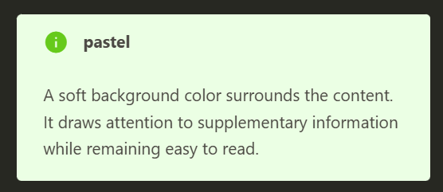
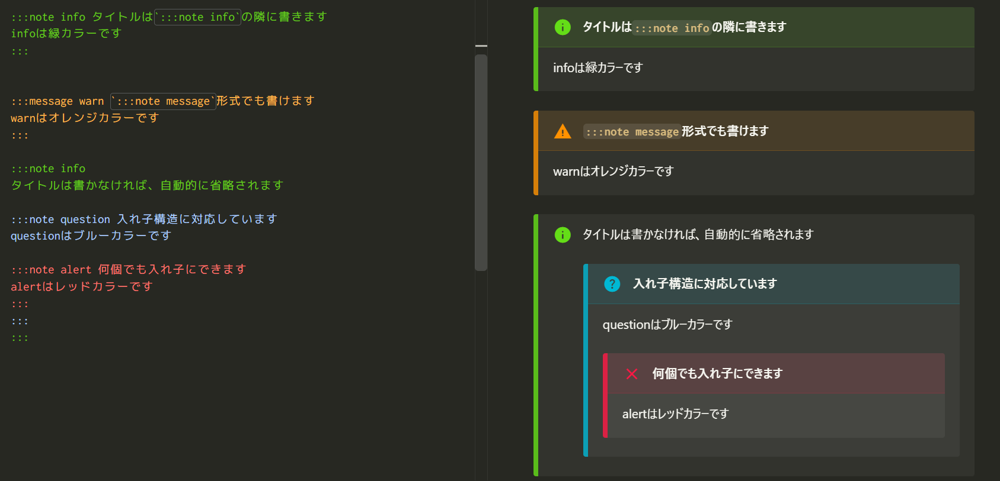
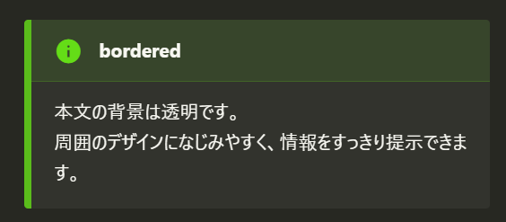
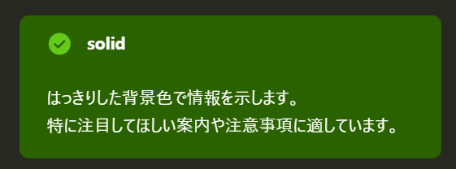
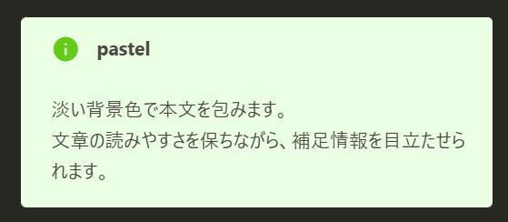

# Markdown Info

[English](#markdown-info) | [日本語](#日本語)


[](https://github.com/yusu79/vscode-markdown-info/releases/latest)

**Markdown Info** is a Visual Studio Code extension for adding visually distinct boxes to Markdown documents.



## Installation

Search for “**Markdown Info**” in the Visual Studio Code Marketplace and install the extension.

<p align="center">

</p>

## Usage

Write a type after `note` or `message`, then close the box with `:::`. Put an optional title next to the type. Boxes have no title by default when the title is omitted.

```markdown
:::note info Write the title next to `:::note info`
The info type is green.
:::

:::message warn You can also use the `:::message` form
The warn type is orange.
:::

:::note info
The title is automatically omitted when it is not specified.

:::note question Nested boxes are supported
The question type is blue.

:::note alert You can nest any number of boxes
The alert type is red.
:::
:::
:::
```

Four types are available.

| Type | Purpose |
| --- | --- |
| `info` | General information |
| `warn` | Warning |
| `alert` | Strong warning |
| `question` | Question or supplementary information |

## Features

- Supports both `note` and `message` syntax.
- Titles are optional.
- Boxes can be nested to any depth.
- Types are color-coded in the editor.
- Each box can be folded from its opening line to the matching `:::`.
- Appearance can be customized through VS Code settings, YAML front matter, or opening-line attributes.

## Opening-line attributes

Add `{}` at the end of the opening line to set classes, an ID, HTML attributes, and CSS embedding for an individual box.

```markdown
:::note info Notice {.custom-box #notice role=note data-source="manual" css=true}
Box content.
:::
```

- `.custom-box` is added as an HTML class.
- `#notice` is added as `id="notice"`.
- Values such as `role=note` are added as HTML attributes.
- `css=true` embeds the styles and icon in the generated HTML. It is a control value and is not rendered as an HTML attribute.
- `css=false` disables CSS embedding for that box.

## Configuration

| Setting | Default | Description |
| --- | --- | --- |
| `markdown-info.previewStyles` | `bordered` | Selects the style used in the Markdown preview. |
| `markdown-info.defaultTitle` | `null` | Sets the default title for boxes without an explicit title. |
| `markdown-info.classes` | `[]` | Adds HTML classes to every box. |
| `markdown-info.attributes` | `{}` | Adds HTML attributes to every box. Use `classes` instead of the `class` attribute. |
| `markdown-info.embedCss` | `false` | Embeds the styles and icon in generated HTML. |

### Preview Styles

`bordered` emphasizes the box with a border and keeps the content background transparent.



`solid` uses a strong filled background.



`pastel` uses a soft filled background.



### YAML front matter

Document-specific settings can be placed under `markdown.note` at the beginning of the Markdown file. Settings below a type name apply only to that type.

```yaml
---
markdown:
  note:
    style: bordered
    classes: [document-box]
    attributes:
      role: note
    embedCss: false
    warn:
      style: solid
      classes: [important-warning]
---
```

## Using boxes in converted HTML

Markdown Info includes features intended for HTML conversion. They are useful when converting Markdown with another extension, such as [yusu79/vscode-markdown-clip](https://github.com/yusu79/vscode-markdown-clip).

### Embed CSS

Use `markdown-info.embedCss` or `css=true` on an opening line to embed box styles and icons directly in generated HTML. Use this when the box appearance should be preserved in the converted output.

```markdown
:::note info {css=true}
The box styles and icon can be embedded directly in the generated HTML.
:::
```

```html
<div class="bordered-admonition info markdown-it-info-embedded" style="position:relative;margin:1.5625em 0;padding:0 1.2rem 0 3.6rem;border-left:.4rem solid rgba(100, 221, 23, .8);border-radius:.2rem;background-color:rgba(255, 255, 255, 0.05);color:inherit;overflow:auto;box-sizing:border-box">
<span class="markdown-it-info-icon" aria-hidden="true" style="position:absolute;top:.925rem;left:1.2rem;display:inline-block;width:1.3rem;height:1.3rem;border:2px solid rgba(100, 221, 23, 1);border-radius:50%;box-sizing:border-box;color:rgba(100, 221, 23, 1);font-family:Arial, sans-serif;font-size:.9rem;font-style:normal;font-weight:700;line-height:1rem;text-align:center">i</span><p class="markdown-it-info-content-start" style="margin-top:.8rem">The box styles and icon can be embedded directly in the generated HTML.</p>
</div>
```

### `{.class}`

If the destination site provides its own CSS, add the classes required by that site. For example, the following adds the paragraph and info-style classes used by the WordPress theme SWELL.

```markdown
:::note info {.wp-block-paragraph .is-style-icon_info}
You can use the styles provided by SWELL.
:::
```

The generated box element receives the `wp-block-paragraph` and `is-style-icon_info` classes. SWELL's CSS must be loaded at the destination for the style to appear.

```html
<div class="bordered-admonition info markdown-it-info-has-content-start wp-block-paragraph is-style-icon_info">
<p class="markdown-it-info-content-start">You can use the styles provided by SWELL.</p>
</div>
```

## Credits

The Visual Studio Code extension icon combines the following two images.

| Image | License | Author/Site |
| --- | --- | --- |
| [Free Markdown Icon](https://iconscout.com/free-icon/markdown-1) | [MIT License](https://opensource.org/license/MIT) | [Benjamin J Sperry](https://iconscout.com/contributors/benjamin-j-sperry) / [IconScout](https://iconscout.com/) |
| [info icon](https://fonts.google.com/icons?selected=Material+Symbols+Outlined:info:FILL@0;wght@400;GRAD@0;opsz@24&icon.query=info&icon.size=24&icon.color=%232a6200) | [Apache License, Version 2.0](https://www.apache.org/licenses/LICENSE-2.0) | [Material Symbols & Icons - Google Fonts](https://fonts.google.com/icons) |

## Plugin

- [yusu79/markdown-it-info](https://github.com/yusu79/markdown-it-info)

## Acknowledgments

This project references the following open-source software.

- [qjebbs/vscode-markdown-extended](https://github.com/qjebbs/vscode-markdown-extended)

## 日本語

[English](#markdown-info) | [日本語](#日本語)

**Markdown Info**は、Markdown文書へ視覚的に区別しやすいボックスを追加するVisual Studio Code拡張機能です。



### インストール

Visual Studio CodeのMarketplaceで「**Markdown Info**」を検索してインストールしてください。

<p align="center">

</p>

### 使い方

`note`または`message`の後ろへタイプを書き、最後を`:::`で閉じます。タイトルはタイプの隣に記述します。省略した場合、初期状態ではタイトルなしになります。

```markdown
:::note info タイトルは`:::note info`の隣に書きます
infoは緑カラーです
:::

:::message warn `:::message`形式でも書けます
warnはオレンジカラーです
:::

:::note info
タイトルは書かなければ、自動的に省略されます

:::note question 入れ子構造に対応しています
questionはブルーカラーです

:::note alert 何個でも入れ子にできます
alertはレッドカラーです
:::
:::
:::
```

使用できるタイプは次の4種類です。

| タイプ | 用途 |
| --- | --- |
| `info` | 一般的な情報 |
| `warn` | 警告 |
| `alert` | 強い警告 |
| `question` | 質問や補足 |

### 特徴

- `note`記法と`message`記法を使用できます。
- タイトルは任意です。
- ボックスを何段階でも入れ子にできます。
- エディター上でタイプ別に色分けします。
- 開始行から対応する`:::`まで折り畳めます。
- VS Code設定、YAMLフロントマター、開始行の属性から表示を調整できます。

### 開始行の属性

開始行の末尾に`{}`を書くと、ボックス単位でclass、ID、HTML属性、CSS埋め込みを指定できます。

```markdown
:::note info お知らせ {.custom-box #notice role=note data-source="manual" css=true}
本文です。
:::
```

- `.custom-box`はHTML classとして追加されます。
- `#notice`は`id="notice"`として追加されます。
- `role=note`などはHTML属性として追加されます。
- `css=true`はスタイルとアイコンを生成HTMLへ埋め込みます。制御用の値なので、HTML属性としては出力されません。
- `css=false`を指定すると、そのボックスではCSSを埋め込みません。

### 設定

| 設定 | 初期値 | 説明 |
| --- | --- | --- |
| `markdown-info.previewStyles` | `bordered` | Markdownプレビューで使用するスタイルを選択します。 |
| `markdown-info.defaultTitle` | `null` | タイトルを省略したボックスのデフォルトタイトルを設定します。 |
| `markdown-info.classes` | `[]` | すべてのボックスへHTML classを追加します。 |
| `markdown-info.attributes` | `{}` | すべてのボックスへHTML属性を追加します。`class`は指定せず、`classes`を使用してください。 |
| `markdown-info.embedCss` | `false` | スタイルとアイコンを生成HTMLへ埋め込みます。 |

#### Preview Styles

`bordered`は枠線で強調し、本文部分の背景を透明にします。



`solid`は、はっきりした背景色で強調します。



`pastel`は、淡い背景色でやさしく強調します。



#### YAMLフロントマター

文書単位の設定は、Markdown先頭の`markdown.note`へ記述できます。タイプ名の下へ書いた設定は、そのタイプだけに適用されます。

```yaml
---
markdown:
  note:
    style: bordered
    classes: [document-box]
    attributes:
      role: note
    embedCss: false
    warn:
      style: solid
      classes: [important-warning]
---
```

### HTML変換で使用する

Markdown Infoには、HTML変換で活用できる機能もあります。[yusu79/vscode-markdown-clip](https://github.com/yusu79/vscode-markdown-clip)などの拡張機能でMarkdownをHTMLへ変換する場合に役立ちます。

#### embedCss

`markdown-info.embedCss`または開始行の`css=true`を使用すると、ボックスのスタイルとアイコンを生成HTMLへ直接埋め込めます。変換先にもボックスの見た目を引き継ぎたい場合に使用してください。

```markdown
:::note info {css=true}
ボックスのスタイルとアイコンを生成HTMLへ直接埋め込めます。
:::
```

```html
<div class="bordered-admonition info markdown-it-info-embedded" style="position:relative;margin:1.5625em 0;padding:0 1.2rem 0 3.6rem;border-left:.4rem solid rgba(100, 221, 23, .8);border-radius:.2rem;background-color:rgba(255, 255, 255, 0.05);color:inherit;overflow:auto;box-sizing:border-box">
<span class="markdown-it-info-icon" aria-hidden="true" style="position:absolute;top:.925rem;left:1.2rem;display:inline-block;width:1.3rem;height:1.3rem;border:2px solid rgba(100, 221, 23, 1);border-radius:50%;box-sizing:border-box;color:rgba(100, 221, 23, 1);font-family:Arial, sans-serif;font-size:.9rem;font-style:normal;font-weight:700;line-height:1rem;text-align:center">i</span><p class="markdown-it-info-content-start" style="margin-top:.8rem">ボックスのスタイルとアイコンを生成HTMLへ直接埋め込めます。</p>
</div>
```

#### `{.class}`

変換先のWebサイトが独自のCSSを提供している場合は、そのサイトで必要なclassを付与できます。例えばWordPressテーマSWELLの段落用classとインフォ用classを付ける場合は、次のように記述します。

```markdown
:::note info {.wp-block-paragraph .is-style-icon_info}
SWELL側のスタイルを活用できます。
:::
```

生成されるボックス要素へ`wp-block-paragraph`と`is-style-icon_info`が追加されます。表示には変換先でSWELLのCSSが読み込まれている必要があります。

```html
<div class="bordered-admonition info markdown-it-info-has-content-start wp-block-paragraph is-style-icon_info">
<p class="markdown-it-info-content-start">SWELL側のスタイルを活用できます。</p>
</div>
```


### クレジット

Visual Studio Code拡張機能で表示されるアイコンは、以下の2つの画像を組み合わせています。

| 画像 | ライセンス | 作者／サイト |
| --- | --- | --- |
| [Free Markdown Icon](https://iconscout.com/free-icon/markdown-1) | [MIT License](https://opensource.org/license/MIT) | [Benjamin J Sperry](https://iconscout.com/contributors/benjamin-j-sperry) / [IconScout](https://iconscout.com/) |
| [info icon](https://fonts.google.com/icons?selected=Material+Symbols+Outlined:info:FILL@0;wght@400;GRAD@0;opsz@24&icon.query=info&icon.size=24&icon.color=%232a6200) | [Apache License, Version 2.0](https://www.apache.org/licenses/LICENSE-2.0) | [Material Symbols & Icons - Google Fonts](https://fonts.google.com/icons) |

### 使用しているプラグイン

- [yusu79/markdown-it-info](https://github.com/yusu79/markdown-it-info)

### 謝辞

このプロジェクトの開発では、以下のオープンソースソフトウェアを参考にしました。

- [qjebbs/vscode-markdown-extended](https://github.com/qjebbs/vscode-markdown-extended)
