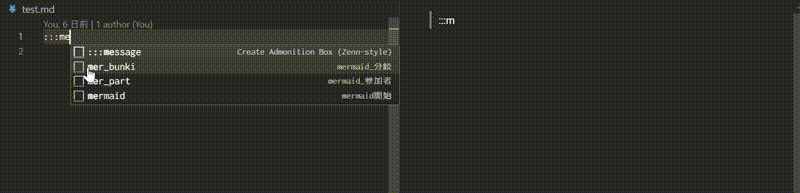

# Markdown Info


[Here is the English version of the "README"](https://github.com/yusu79/vscode-markdown-info/blob/main/README.en.md)

**VSCode Markdown Info**は、Markdown文書内で簡単に「Infoボックス」を作成できるVisual Studio Codeの拡張機能です。

この拡張機能を使用することで、[Qiita](https://qiita.com/)や[Zenn](https://zenn.dev/)スタイルの情報ボックスを手軽に追加し、重要な情報を視覚的に強調することができます。


<!-- omit in toc -->
## 目次
- [インストール](#インストール)
- [使い方](#使い方)
- [解説](#解説)
- [特徴と注意点](#特徴と注意点)
- [設定](#設定)
- [使用しているプラグイン](#使用しているプラグイン)
- [謝辞](#謝辞)

## インストール
VScodeのマーケットプレイスで「**Markdown Info**」と入力してください｡

<p align="center">

</p>

## 使い方
| 形式      | Markdown                     | 
| ------------- | ---------------------------- | 
| Qiita形式 | `:::note タイプ タイトル`    | 
| Zenn形式  | `:::message タイプ タイトル` | 


Qiita形式:


Zenn形式:





## 解説
VSCode上でQiitaやZenn形式の「Infoボックス」を作成できる拡張機能です。

Infoボックスは以下の形式で作成します：

```markdown
:::note タイプ タイトル
内容
:::
```

または

```markdown
:::message タイプ タイトル
内容
:::
```

Infoボックスには4種類のタイプがあります：

1. info（デフォルト）：一般的な情報
2. warn：警告
3. alert：強い警告
4. question：質問や疑問

## 特徴と注意点

- デフォルトのタイプは「info」です。Zennの元の仕様とは異なるので注意が必要です。
- タイトルはタイプの直後に記述します。これはQiitaの元の仕様とは異なる点です。
- Infoボックスは入れ子構造にも対応しているため、複雑な情報を整理して表示することができます。


## 設定

### Default Title
タイトルが指定されていない場合に反映されるデフォルト値を設定できます。
初期状態では「**ここにタイトルを記述してください**」が設定されています。


### Preview Styles
Markdownのプレビュー画面に反映されるCSSのスタイルシートを選択できます。利用可能なオプションは以下の通りです:

default: デフォルトのスタイルシートを使用します。


qiita: Qiita風のスタイルシートを適用します。


zenn: Zenn風のスタイルシートを適用します。


## 使用しているプラグイン
- [yusu79/markdown-it-info](https://github.com/yusu79/markdown-it-info)

## 謝辞
このプロジェクトの開発にあたり、以下のオープンソースソフトウェアを参考にさせていただきました。この場を借りて感謝の意を表します。

- [qjebbs/vscode-markdown-extended](https://github.com/qjebbs/vscode-markdown-extended)
